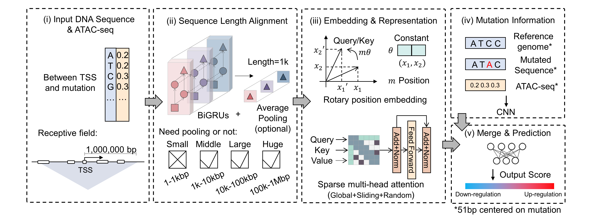

# EMO
Predicting the effect of non-coding mutations on quantitative gene expression using deep learning

## Environment
- Python == 3.9
- Tensorflow-gpu == 2.7
- Protobuf == 3.20
- Scikit-learn == 1.1