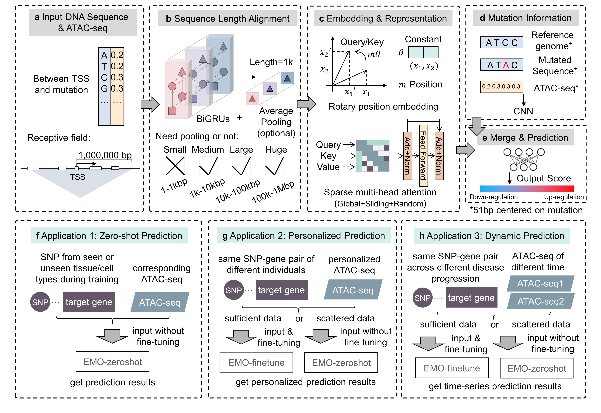

# EMO
Predicting the effect direction of non-coding mutations on  gene expression using deep learning

<p align="center"></p>

## Environment
- Python == 3.9
- Tensorflow-gpu == 2.7
- Protobuf == 3.20
- Scikit-learn == 1.1

## Running interface
Please download the reference genome and the pretrained model weights from the [Cloud Storage](https://www.psymukb.net:83/EMO_Download/trained_weights/) (download all weights and save to one folder). Please keep the same file name as when you downloaded it, and the program will automatically identify which model to use. 

```python
import numpy as np
from src.utils import *

window_len = 51

# Input examples, please replace the numpy arrays by real ATAC-seq arrays
input_variant = 'chr19_55071925_G_A' # hg38, only single-point mutation accepted
TSS_distance = -95
atac_variant = np.random.rand(window_len) # centered on the DNA variant
atac_between = np.random.rand(np.abs(TSS_distance) + 1) # between TSS and the DNA variant (include both ends)

# Define path of reference genome 
genome_path = '/reference_genome_hg38/' # In this case, '/reference_genome_hg38/chr19.fasta' will be used.

# Define path of pretrained model weights 
weights_path = '/trained_weights/' # In this case, '/trained_weights/small_trained_weights.tf' will be used.

# Get prediction output, this case takes about 10 seconds
prediction_output = get_prediction_result(input_variant, TSS_distance, atac_variant, atac_between, genome_path, weights_path) 
prediction_output # {'score': ..., 'label': ...}
```

## Training and fine-tuning
You can specify the model size and other hyper-parameters through the command:
```shell
cd [work_path]
python training.py -m small --epoch 100 --lr 0.005 --save_dir model/weights/
```
You can also fine-tune the model on your own dataset:
```shell
cd [work_path]
python finetune.py -m small --epoch 100 --lr 0.005 --save_dir model/weights_finetune/ -t [tissue]
```
Note: 
- If the number of training data samples used for fine-tuning is less than 200, the script will throw an exception. We recommend using our pre-trained parameters directly.
- The parameter [tissue] is only used for distinguishing different tissues (no actual function) and can be removed in the script.
- When using the preprocessing scripts and the parameters of EMO to process and predict on your own dataset, place all **Reference Allele** to the "before mutation" input branch for hg38 sequence alignment.
- When fine-tuning with your own dataset, place all **Effect Allele** to one side of the mutation input branch (before mutation/after mutation) for data alignment of the representation learning.

## Processed training dataset and model weights
|model|trained weights|parameter|processed training data|test data|
|:---:|:---:|:---:|:---:|:---:|
|Small|[Download](https://www.psymukb.net:83/EMO_Download/trained_weights/small/)|1,419,602|[Download](https://www.psymukb.net:83/EMO_Download/training_test_set/small/train_small.pkl)|[Download](https://www.psymukb.net:83/EMO_Download/training_test_set/small/test_small.pkl)|
|Middle|[Download](https://www.psymukb.net:83/EMO_Download/trained_weights/middle/)|2,593,298|[Download](https://www.psymukb.net:83/EMO_Download/training_test_set/middle/train_middle.pkl)|[Download](https://www.psymukb.net:83/EMO_Download/training_test_set/middle/test_middle.pkl)|
|Large|[Download](https://www.psymukb.net:83/EMO_Download/trained_weights/large/)|8,353,298|[Download](https://www.psymukb.net:83/EMO_Download/training_test_set/large/train_large.pkl)|[Download](https://www.psymukb.net:83/EMO_Download/training_test_set/large/test_large.pkl)|
|Huge|[Download](https://www.psymukb.net:83/EMO_Download/trained_weights/huge/)|65,355,602|[Download](https://www.psymukb.net:83/EMO_Download/training_test_set/huge/train_huge.pkl)|[Download](https://www.psymukb.net:83/EMO_Download/training_test_set/huge/test_huge.pkl)|

## Raw data
|Data|resource|
|:---:|:---:|
|fine-mapping eQTL|[GTEx v8](https://gtexportal.org/home/datasets)|
|tissue & primary cell ATAC-seq (hg19)|[EpiMap](https://personal.broadinstitute.org/cboix/epimap/metadata/Short_Metadata.html)|
|GRCh38/hg38 genome|[UCSC Genome Browser](https://genome.ucsc.edu/cgi-bin/hgGateway)|
|singel-cell eQTL (hg19)|[OneK1K](https://onek1k.org/)|
|Brain tissue eQTL|[MetaBrain](https://www.metabrain.nl/)|
